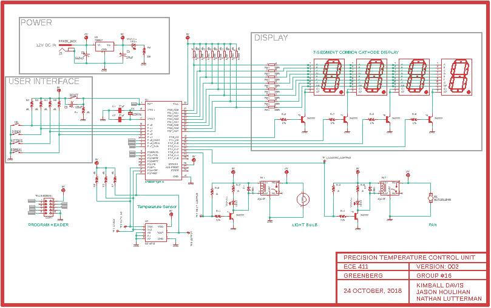

# Portland State University

## ECE 411 Practicum Project - Group 16

https://pdx-lutter.github.io/pdx-ece411-fall2018-kjn/

### Precision Temperature Control Unit

### Group Members

* Nathan Lutterman  
* Kimball Davis  
* Jason Houlihan  

### What is it?

Our group is designing and building a temperature control unit.  In a nutshell, the device reads some ambient temperature from a temperature sensor.  If the temperature being read is outside of some bound, above or blow, the device activates and utilizes a fan or a lamp (as a heater) respectively.

It's intended to be a small, portable temperature control unit.  The user interface consists of several 7-segment digital displays which are used as feedback for the user while inputting values for thresholds, as well as displaying the temperature being read.

### What's in it?

The device mostly charge is an AT89S52 8-bit microcontroller.  It'll be driving the 7-segment displays, reading the data from the temperature sensor, and triggering the relays for the fan and lamp.

---

### Important Documents

[Preliminary EAGLE PCB Design Schematic](docs/schematics/preliminary.sch)

